# Spectre.Console Cheat Sheet

## Styles


```cs
// Styles: https://spectreconsole.net/appendix/styles
AnsiConsole.MarkupLine("[dim]Dim[/] text");
AnsiConsole.MarkupLine("[bold]Bold[/] text");
AnsiConsole.MarkupLine("[italic]Italic[/] text");
AnsiConsole.MarkupLine("[underline]Underline[/] text");
AnsiConsole.MarkupLine("[red on blue]Colored[/] text");
AnsiConsole.MarkupLine("[invert red on blue]Inverted[/] text");
AnsiConsole.MarkupLine("[conceal]Hidden[/] text");
AnsiConsole.MarkupLine("[slowblink]Opening[/] shortly");
AnsiConsole.MarkupLine("[rapidblink]Closing[/] shortly");
AnsiConsole.MarkupLine("[link=https://github.com/SpicyCoder]Github[/] profile");
```

---

## Panel

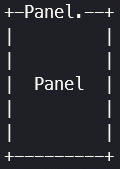

```cs
// Panel: https://spectreconsole.net/widgets/panel
var panel = new Panel("Panel");
panel.Header = new PanelHeader("Panel Header");
panel.Border = BoxBorder.Ascii;
panel.Padding = new Padding(2, 2, 2, 2);
// panel.Expand = true;
AnsiConsole.Write(panel);
```

---

## Table

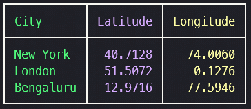

```cs
// Table: https://spectreconsole.net/widgets/table
var table = new Table();
table.AddColumns($"[bold {Color.Green}]City[/]", $"[bold {Color.Blue}]Latitude[/]", $"[bold {Color.Yellow}]Longitude[/]");
table.AddRow($"[{Color.Green}]New York[/]", $"[{Color.Blue}]40.7128[/]", $"[{Color.Yellow}]74.0060[/]");
table.AddRow($"[{Color.Green}]London[/]", $"[{Color.Blue}]51.5072[/]", $"[{Color.Yellow}]0.1276[/]");
table.AddRow($"[{Color.Green}]Bengaluru[/]", $"[{Color.Blue}]12.9716[/]", $"[{Color.Yellow}]77.5946[/]");

table.Columns[1].Alignment = Justify.Right;
table.Columns[2].Alignment = Justify.Right;
AnsiConsole.Write(table);
```

---

## Tree

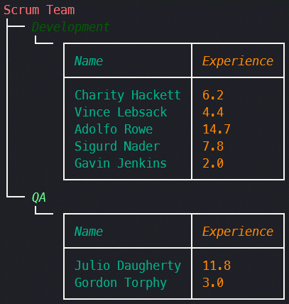

```cs
// Tree: https://spectreconsole.net/widgets/tree
var faker = new Faker(); // from Bogus, to generate fake data
var root = new Tree("[bold red]Scrum Team[/]");

// Dev
var dev = root.AddNode($"[italic {Color.DarkGreen}]Development[/]");

var devTable = new Table();
devTable.AddColumns($"[italic {Color.DarkCyan}]Name[/]", $"[italic {Color.DarkOrange}]Experience[/]");
for (var i = 0; i < 5; i++)
{
    devTable.AddRow($"[{Color.DarkCyan}]{faker.Name.FullName()}[/]", $"[{Color.DarkOrange}]{faker.Random.Double(0, 20):F1}[/]");
}

dev.AddNode(devTable);

// QA
var qa = root.AddNode($"[italic {Color.Lime}]QA[/]");

var qaTable = new Table();
qaTable.AddColumns($"[italic {Color.DarkCyan}]Name[/]", $"[italic {Color.DarkOrange}]Experience[/]");
for (var i = 0; i < 2; i++)
{
    qaTable.AddRow($"[{Color.DarkCyan}]{faker.Name.FullName()}[/]", $"[{Color.DarkOrange}]{faker.Random.Double(0, 20):F1}[/]");
}

qa.AddNode(qaTable);
AnsiConsole.Write(root);
```

---

## Bar Chart

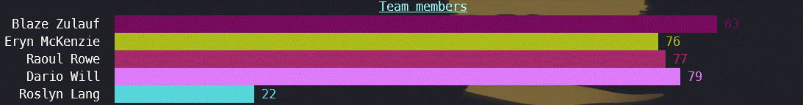

```cs
// Bar Chart: https://spectreconsole.net/widgets/barchart
var faker = new Faker(); // from Bogus, to generate fake data
var teamFaker = Enumerable
    .Range(1, 5)
    .Select(_ =>
        new BarChartItem(
            faker.Name.FullName(),
            faker.Random.Int(1, 100),
            new Color(faker.Random.Byte(), faker.Random.Byte(), faker.Random.Byte())))
    .ToList();

AnsiConsole.Write(new BarChart()
    .Label($"[bold underline {Color.Aqua}]Team members[/]")
    .CenterLabel()
    .Width(100)
    .AddItems(teamFaker, member => new BarChartItem(member.Label, member.Value, member.Color)));
```

---

## Breakdown Chart


```cs
// Breakdown chart: https://spectreconsole.net/widgets/breakdownchart
var faker = new Faker(); // from Bogus, to generate fake data
var teamFaker = Enumerable
    .Range(1, 5)
    .Select(_ =>
        new BarChartItem(
            faker.Name.FullName(),
            faker.Random.Int(1, 100),
            new Color(faker.Random.Byte(), faker.Random.Byte(), faker.Random.Byte())))
    .ToList();
var rule = new Rule($"[{Color.Olive}]Breakdown chart[/]");
rule.Border = BoxBorder.Ascii;
AnsiConsole.Write(new BreakdownChart()
    .Width(100)
    .AddItems(
        teamFaker,
        member => new BreakdownChartItem(member.Label, member.Value, member.Color.Value)));
```

---

## Rule


```cs
// Rule: https://spectreconsole.net/widgets/rule
var rule = new Rule($"[{Color.Olive}]Breakdown chart[/]");
rule.Border = BoxBorder.Ascii;
AnsiConsole.Write(rule);
```

---

## Calendar

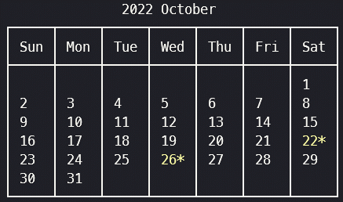

```cs
// Calendar: https://spectreconsole.net/widgets/calendar
var calendar = new Calendar(DateTime.Now)
    .AddCalendarEvent(DateTime.Now.AddDays(-2))
    .AddCalendarEvent(DateTime.Now.AddDays(2))
    .HighlightStyle(Style.Parse($"{Color.Yellow} bold"));

AnsiConsole.Write(calendar);
```

---

## Figlet


```cs
// Figlet: https://spectreconsole.net/widgets/figlet
AnsiConsole.Write(new FigletText("Calm down Morty").Centered().Color(Color.DarkOrange));
```

---

## Text Path

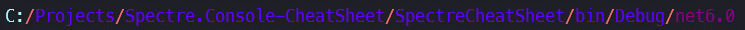

```cs
// Text path: https://spectreconsole.net/widgets/text-path
var path = new TextPath(AppContext.BaseDirectory)
    .Alignment(Justify.Left)
    .RootColor(Color.Aqua)
    .SeparatorColor(Color.Red)
    .StemColor(Color.BlueViolet)
    .LeafColor(Color.DarkMagenta);

AnsiConsole.Write(path);
```

---

## Prompts

### Simple Prompt + Validation


```cs
var name = AnsiConsole.Ask<string>($"[bold {Color.Olive}]Welcome, [/]{Environment.NewLine}[{Color.DarkOrange}]Please enter your name:[/]");
```

### Validation

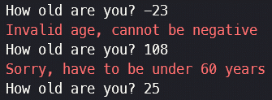

```cs
var age = AnsiConsole.Prompt(
    new TextPrompt<int>("How old are you?")
    .Validate(x =>
    {
        return x switch
        {
            <= 0 => Spectre.Console.ValidationResult.Error($"[{Color.Red}]Invalid age, cannot be negative[/]"),
            < 21 => Spectre.Console.ValidationResult.Error($"[{Color.Red}]Sorry, must be atleast 21 years[/]"),
            >= 60 => Spectre.Console.ValidationResult.Error($"[{Color.Red}]Sorry, have to be under 60 years[/]"),
            _ => Spectre.Console.ValidationResult.Success()
        };
    })
);
```

### Selection

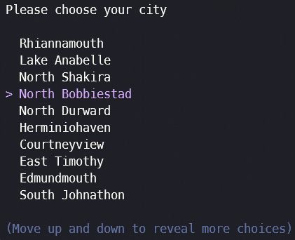

```cs
// Selection: https://spectreconsole.net/prompts/selection
var faker = new Faker();
var cities = Enumerable.Range(1, 20).Select(x => faker.Address.City()).Distinct().ToArray();
var city = AnsiConsole.Prompt(new SelectionPrompt<string>()
    .Title("Please choose your city")
    .AddChoices(cities));
```

### Multi Selection

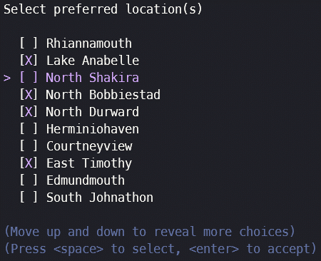

```cs
// Multi selection: https://spectreconsole.net/prompts/multiselection
var faker = new Faker();
var cities = Enumerable.Range(1, 20).Select(x => faker.Address.City()).Distinct().ToArray();
var preferredCities = AnsiConsole.Prompt(new MultiSelectionPrompt<string>()
    .Title("Select preferred location(s)")
    .AddChoices(cities));
```

### Prompt result as Table

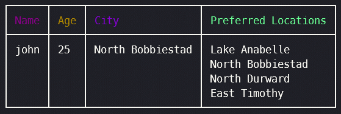

```cs
var selectionTable = new Table();
selectionTable.AddColumns($"[bold {Color.DarkMagenta}]Name[/]", $"[bold {Color.DarkGoldenrod}]Age[/]", $"[bold {Color.DarkViolet}]City[/]", $"[bold {Color.Lime}]Preferred Locations[/]");
selectionTable.AddRow(name, age.ToString(), city, string.Join(Environment.NewLine, preferredCities));
AnsiConsole.Write(selectionTable);
```

---

### Live Display

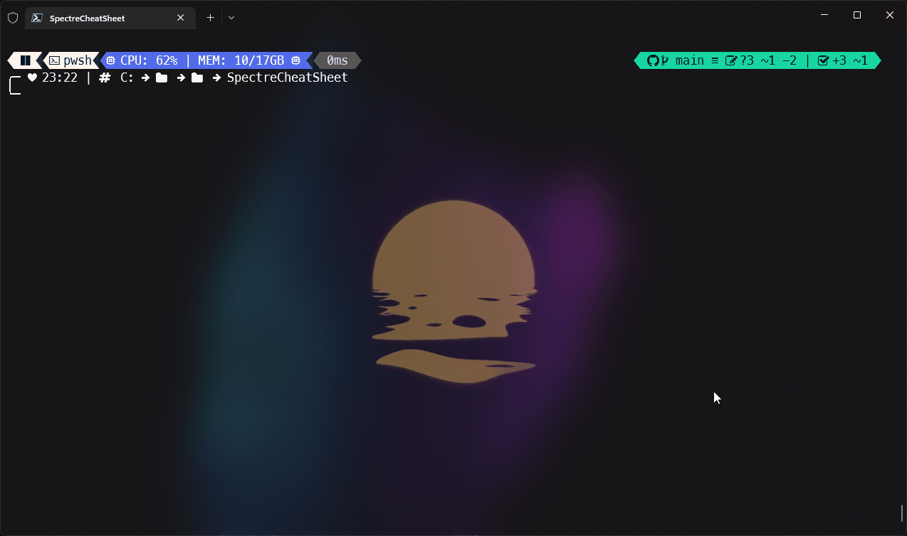

```cs
// Live display: https://spectreconsole.net/live/live-display
var realtimeTable = new Table().Centered();
AnsiConsole.Live(realtimeTable)
    .AutoClear(false)
    .Start(context =>
    {
        realtimeTable.AddColumns(
            $"[bold {Color.Purple}]Id[/]",
            $"[bold {Color.Yellow}]Email[/]",
            $"[bold {Color.Lime}]First Name[/]",
            $"[bold {Color.DarkMagenta}]Last Name[/]");
        context.Refresh();

        var client = new UsersClient();
        for (var i = 1; i <= 12; i++)
        {
            var response = client.GetUser(i).Result;
            var user = response.User;
            realtimeTable.AddRow(
                    $"[link=https://reqres.in/img/faces/{user.Id}-image.jpg {Color.Purple}]{user.Id}[/]",
                    $"[{Color.Yellow}]{user.Email}[/]",
                    $"[{Color.Lime}]{user.FirstName}[/]",
                    $"[{Color.DarkMagenta}]{user.LastName}[/]");

            context.Refresh();
        }
    });
```
